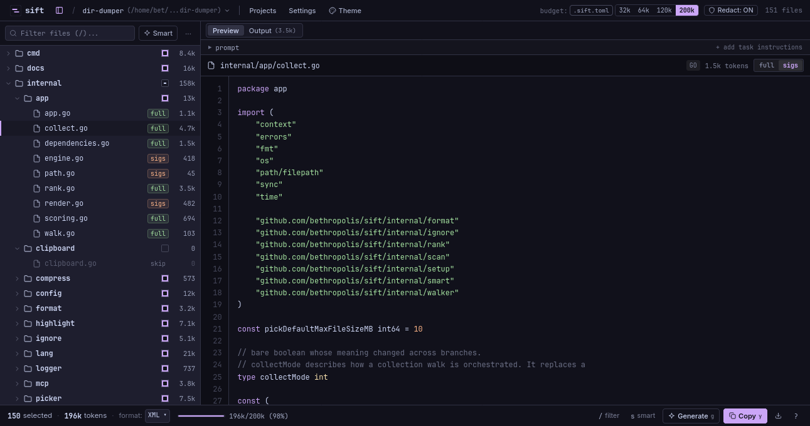

# Sift

[](https://www.codefactor.io/repository/github/bethropolis/sift/overview/main)
[](https://github.com/bethropolis/sift/releases/latest)
[](https://github.com/bethropolis/sift/blob/main/LICENSE)
[](https://pkg.go.dev/github.com/bethropolis/sift/)
[](https://golang.org/doc/go1.26)

Your repo is too big to paste into a chatbot. That's the whole problem.
`sift` fixes it: point it at a directory, get back one clean document with
exactly the code the model needs.


## What it does

sift walks a project directory, skips what you wouldn't paste into a prompt (`.gitignore`d files, dotfiles, binaries, lockfiles), and writes the rest to a single document for an LLM. Output can be plain text, Markdown, JSON, or XML.

Files are ranked by git relevance: modified files first, then files in recent diffs, then files in recent commits. Pass `--budget 200k` and sift fills the document in that order and stops when the budget is used up.

Secrets are redacted before anything is rendered. This covers AWS, GitHub, Slack, Google, and Stripe keys.

With `--mode signatures`, sift uses tree-sitter to keep declarations and comments and drop function bodies. You keep the structure of the code at a fraction of the tokens.

The result can go to a file, stdout, or the clipboard (`--clipboard`). `sift copy` puts the last `codebase.md` back on the clipboard.

<details>
<summary>Languages supported in signature mode</summary>

Go, Rust, JavaScript/TypeScript (including TSX), Python, PHP, Java, Kotlin, C#, C/C++, Ruby, Swift, Dart/Flutter, Zig.

</details>

### Commands

| Command  | Description                                       |
| :------- | :------------------------------------------------ |
| `dump`   | Render every eligible file                        |
| `pick`   | Choose files yourself in the TUI, then render     |
| `select` | Let git relevance and the budget choose the files |
| `clone`  | Clone a repo, then run on it                      |
| `copy`   | Re-copy the last output to the clipboard          |
| `diff`   | Render files changed relative to a git ref        |
| `delta`  | Render files changed since the last dump          |
| `follow` | Render a file plus its import-graph neighbors     |
| `watch`  | Re-render whenever files change                   |
| `serve`  | Run sift from a browser                           |

Running `sift` with no command opens the picker.

## Picker

`sift pick` (or just `sift`) opens a two-pane TUI: file tree on the left, preview on the right, and a budget bar at the bottom.

Each file is in one of three modes: `FULL`, `SIGS`, or `SKIP`. Press `m` to cycle a file through them, or press `s` to have git relevance assign modes for you. `/` starts a fuzzy search. `p` attaches a task prompt, with presets for review, refactor, and debugging. `Y` builds `codebase.md` and copies it to the clipboard. `d` opens the commit-range picker.

Nerd Font icons are on by default. Pass `--no-nerd-fonts` to turn them off.

The full key list is in [docs/picker.md](docs/picker.md).

## Rather click? Use the browser.

`sift serve` runs the same picker as a web UI. `sift serve --app` goes one further: chromeless window, auto-login, and closing the window stops the server.



Details: [docs/serve.md](docs/serve.md).

## Incremental deltas

`sift delta` renders only what changed since the last recorded dump.
`--patch` emits a raw unified diff instead, which is cheaper token-wise:

```bash
sift delta --patch --clipboard
sift delta --since main
```

## Installation

**macOS / Linux** — installs to `~/.local/bin`:

```bash
curl -fsSL https://bethropolis.github.io/sift/install.sh | sh
```

**macOS (Homebrew):**

```bash
brew install bethropolis/tap/sift
```

**Arch Linux (AUR):**

```bash
yay -S sift-context-bin
```

**Windows (Scoop):**

```powershell
scoop bucket add bethropolis https://github.com/bethropolis/scoop-bucket
scoop install sift
```

**Go toolchain** (CLI only — no embedded `serve` web UI):

```bash
go install github.com/bethropolis/sift/cmd/sift@latest
```

**From source or a prebuilt archive:**

```bash
git clone https://github.com/bethropolis/sift.git
cd sift
./scripts/install.sh
```

Prebuilt archives for Linux, Windows, macOS, FreeBSD, and Android (amd64 and
arm64) are on the
[releases page](https://github.com/bethropolis/sift/releases).

<details>
<summary>Uninstall</summary>

From a checkout: `./scripts/uninstall.sh` (`--purge` also removes
`~/.config/sift`). Otherwise use your package manager (`brew uninstall`,
`scoop uninstall`, `rm ~/.local/bin/sift`). Full details:
[docs/installation.md](docs/installation.md).

</details>

## Usage

```bash
sift                # interactive picker
sift dump [path]    # scan a directory (writes codebase.md next to the root)
sift pick [path]    # interactively choose files, then render
sift select [path]  # automatically select useful files
sift diff [ref]     # files changed relative to a git ref
sift delta [path]   # only changes since the last recorded dump
sift follow <file>  # render a file plus its import-graph neighbors
sift watch [path]   # re-render on file changes
sift serve          # browser picker at http://127.0.0.1:7777
```

<details>
<summary>More examples</summary>

```bash
sift dump --style markdown
sift dump --dir ./src --style xml --clipboard
sift dump --budget 50000
sift dump --mode signatures --style xml
sift dump --prompt "Review this codebase for race conditions."
sift select . --selection-only --print-selection
sift pick --no-nerd-fonts
```

`sift dump` writes `codebase.md` by default; `--output -` writes to stdout
instead. `sift --help` lists everything else (profiles, ignore rules, secret
scanning).

</details>

## Profiles

A `.sift.toml` in the scanned directory, or `~/.config/sift/config.toml`
globally, bundles flags under a `--profile` name. Flags always win over
profile values:

```toml
[profiles.claude]
style = "xml"
budget = 60000
compress_mode = "signatures"
extensions = ["go", "md"]
ignore = ["vendor/**", "testdata/**"]
prompt_file = "prompts/review.md"
smart_filter = true
copy_on_generate = true
```

```bash
sift dump --profile claude
```

## Documentation

- [Installation](docs/installation.md)
- [Usage](docs/usage.md)
- [Interactive picker](docs/picker.md)
- [Web UI (`serve`)](docs/serve.md)
- [Configuration and profiles](docs/configuration.md)
- [Output formats and prompts](docs/output.md)
- [Incremental deltas](docs/delta.md)

## Development

Needs Go 1.26+ and a POSIX shell (`just test`, `just test-race`, `just build`,
`just dump`, `just pick` cover the common recipes):

```bash
go test ./...
go vet ./...
go test -race ./...
```

## Contributing

Issues and pull requests are welcome.

## License

[MIT](LICENSE)
