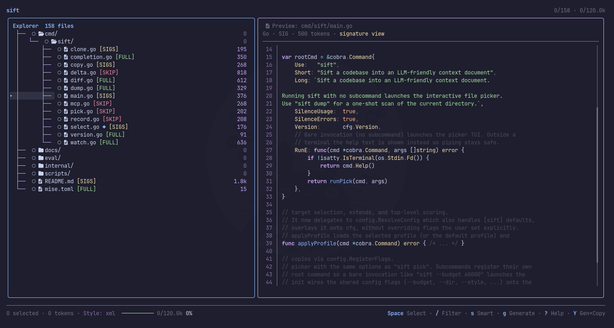

# Sift

[](https://www.codefactor.io/repository/github/bethropolis/sift/overview/main)
[](https://github.com/bethropolis/sift/releases/latest)
[](https://github.com/bethropolis/sift/blob/main/LICENSE)
[](https://pkg.go.dev/github.com/bethropolis/sift/)
[](https://golang.org/doc/go1.26)

`sift` turns a project directory into a single LLM-ready context document. It
walks the tree, respects `.gitignore`, and renders the result as plain text,
Markdown, JSON, or XML, with token budgeting, secret redaction, signature-only
compression, and git-relevance ranking so the most important code fits inside
a model's context window.



## What it does

Sift scans a repo, filters out the noise (`.gitignore`, hidden files,
binaries, lockfiles), and packs what's left into one document you hand to an
LLM. Along the way it:

* Counts tokens against a `--budget` and keeps the highest-priority files
  when the budget is tight, using git relevance to decide what matters:
  modified files first, then recent diffs, then recent commits.
* Redacts secrets (AWS, GitHub, Slack, Google, Stripe keys) before anything
  gets rendered.
* Compresses files to signatures only (`--mode signatures`) via tree-sitter,
  keeping declarations and comments while dropping function bodies. Go,
  Rust, JavaScript/TypeScript (incl. TSX), Python, PHP, Java, Kotlin, C#,
  C/C++, Ruby, Swift, Dart/Flutter, and Zig are supported.
* Copies straight to the clipboard with `--clipboard`, or writes to a file,
  or streams to stdout. `sift copy` copies an existing `codebase.md` document
  for pasting into another app.

`dump`, `pick`, `select`, `clone`, `copy`, `diff`, `delta`, and `watch` cover the different
ways you'd want to generate that document: a full one-shot scan, an
interactive selection, an automatic budget-aware selection, just what
changed relative to a git ref, just what changed since your last dump, or a
document that keeps re-rendering as you edit.

## Interactive picker

`sift pick` (or bare `sift`) opens a dual-pane TUI: a foldable file tree on
the left with three-state checkboxes and live token counts, a preview pane
with syntax highlighting and secret warnings on the right, and a budget bar
in the footer.

Each file can be `FULL`, `SIGS` (signature-only), or `SKIP`, cycled with `m`.
Press `s` to smart-select by git relevance and budget, `/` to fuzzy-filter
the tree, `p` to attach a task prompt (with presets for review, refactor,
bug investigation, and so on), and `Y` to generate the selected context and
copy `codebase.md`.
`d` opens the delta modal for picking a commit range interactively. Nerd
Font glyphs are on by default; pass `--no-nerd-fonts` for plain ASCII.

See [docs/picker.md](docs/picker.md) for the full keybinding reference.

## Incremental deltas

A full dump gets expensive to re-send on every turn. `sift delta` renders
only what changed since the last recorded dump, keyed by the project's
absolute path and stored under `~/.config/sift/state.json`, outside the repo.

```bash
sift delta                 # full content of files changed since last dump
sift delta --patch         # raw unified diff in a <context_update> block
sift delta --since main    # compare against a specific ref or branch
sift delta --patch --clipboard
```

`--patch` is the cheaper option token-wise: it emits the raw `git diff`
between the recorded baseline and `HEAD`, wrapped in a `<context_update>`
block, instead of full file contents.

## Installation

macOS and Linux:

```bash
curl -fsSL https://bethropolis.github.io/sift/install.sh | sh
```

This installs to `~/.local/bin`; set `SIFT_INSTALL_DIR` to change that.

Homebrew:

```bash
brew install bethropolis/tap/sift
```

Windows (Scoop):

```powershell
scoop bucket add bethropolis https://github.com/bethropolis/scoop-bucket
scoop install sift
```

Go:

```bash
go install github.com/bethropolis/sift/cmd/sift@latest
```

Prebuilt archives for Linux, Windows, macOS, FreeBSD, and Android (amd64 and
arm64) are on the
[releases page](https://github.com/bethropolis/sift/releases). Or build from
source:

```bash
git clone https://github.com/bethropolis/sift.git
cd sift
./scripts/install.sh
```

## Usage

```bash
sift                # bare invocation launches the interactive picker
sift dump [path]    # scan a directory and render its contents
sift pick [path]    # interactively choose files, then render
sift select [path]  # automatically select useful files
sift diff [ref]     # dump files changed relative to a git ref
sift delta [path]   # dump only changes since the last recorded dump
sift watch [path]   # re-render the document on file changes
```

`sift dump` writes `codebase.md` next to the scanned root by default; use
`--output -` to write to stdout instead.

```bash
sift dump --style markdown
sift dump --dir ./src --style xml --clipboard
sift dump --budget 50000
sift dump --mode signatures --style xml
sift dump --prompt "Review this codebase for race conditions."
sift select . --selection-only --print-selection
sift select . --selection-only --selection-format json
sift pick --no-nerd-fonts
```

Run `sift --help` or `sift <command> --help` for the full flag list,
including profiles, ignore rules, secret scanning, and window-title
configuration.

## Profiles

A `.sift.toml` in the scanned directory, or `~/.config/sift/config.toml`
globally, packages a set of flags under a name you reference with
`--profile`:

```toml
[profiles.claude]
style = "xml"
budget = 60000

[profiles.rust-strict]
extensions = ["rs"]
mode = "signatures"
prompt = "Review this Rust codebase for unsafe usage."
```

```bash
sift dump --profile claude
```

Command-line flags always win over profile values.

## Documentation

- [Installation](docs/installation.md)
- [Usage](docs/usage.md)
- [Interactive picker](docs/picker.md)
- [Configuration and profiles](docs/configuration.md)
- [Output formats and prompts](docs/output.md)
- [Incremental deltas](docs/delta.md)

## Development

Needs Go 1.26+ and a POSIX shell for the helper scripts.

```bash
go test ./...
go vet ./...
go test -race ./...
```

`just test`, `just test-race`, `just build`, `just dump`, and `just pick`
cover the common `justfile` recipes.

## Contributing

Issues and pull requests are welcome.

## License

[MIT](LICENSE)
